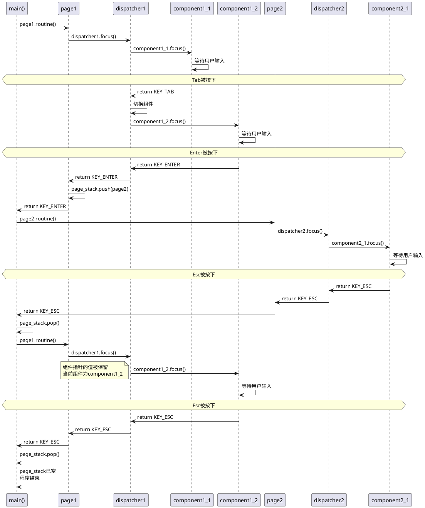
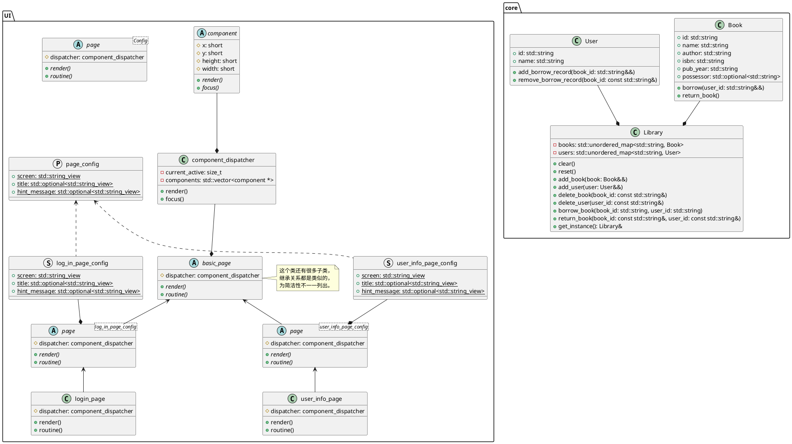

# 课程设计

课程设计选题：图书管理系统  
小组成员：钟敦复、陈子健、李晓咏、韦明治、李峰  

## 核心功能
本图书管理系统的核心功能包括：
- 用户界面交互（TUI）
- 设置页面
- 密码系统（登录、注销、修改密码）
- 增加、删除、修改、查询图书和用户信息。
- 借阅书籍、归还书籍、查询借阅记录。

## 给维护者  
注意以下几个文件的高度相似性，修改其中一个文件时请注意同步修改另外一个文件：  
`core/book.cpp`与`core/user.cpp`  
`core/book.h`与`core/user.h`  
`UI/pages/display_book_page.cpp`与`UI/pages/display_user_page.cpp`  
`UI/pages/display_book_page.h`与`UI/pages/display_user_page.h`  
`UI/pages/book_info_page.cpp`与`UI/pages/user_info_page.cpp`  
`UI/pages/book_info_page.h`与`UI/pages/user_info_page.h`  

## 编译
本项目使用CMake在windows平台下进行编译，要求编译器gcc版本不低于`15.1.0`，请确保已安装CMake。  
编译完成后，`cmake-build-debug/library.exe`即为图书管理系统的可执行文件。  

## 命名规范
使用下划线命名法（snake_case）来命名变量和函数。  
特殊地，`src/core`目录下的类名使用驼峰命名法（CamelCase），如`Book`、`User`、`Library`等，这是为了可以直接使用`book` `user` `library`等变量名而避免重名。  

## 主要模块
本图书管理系统主要包括核心与UI界面两个模块：  
- 核心模块：负责图书馆的基本功能实现，如图书和用户的增删改查等。  
  - 书籍类（`Book`）：用于表示书籍的基本信息，包含ID、书名、作者、ISBN等。  
  - 用户类（`User`）：用于表示用户的基本信息，包含ID、姓名。  
  - 图书馆类（`Library`）：用于管理图书和用户信息。  
- UI界面模块：负责图书馆的用户界面交互。  
  - 组件类（`component`）：用于创建和管理界面组件，如文本框、弹窗等。  
  - 页面类（`page`）：用于显示不同的页面内容，如图书列表、用户列表等。  

## 全局对象
| 对象名          | 定义处                   | 类型                   | 作用                |
|--------------|-----------------------|----------------------|-------------------|
| `page_stack` | `src/UI/pages/page.h` | `std::stack<* page>` | 全局对象，用于存储页面对象的栈   |
| `Library`    | `src/core/library.h`  | `Library`            | 全局单例对象，表示唯一的图书馆实例 |

## 控制流
### 程序载入
程序载入时，首先会创建一个全局的`Library`单例对象，并从文本文件中读取初始化图书馆的基本信息（若缺少文本文件将会载入预设的数据）。接着，程序将进入主函数，主函数会创建一个初始页面（即登录页面），并将其压入`page_stack`中。随后，主函数将调用该页面的`routine()`方法，开始事件循环。
### 创建页面
创建页面时，一个新页面将被压入`page_stack`中。`page::page()`会被调用，初始化页面的组件和布局，这些组件将被动态申请内存并以指针形式存储在`dispatcher`中，便于多态调用。随后，将控制流交还给主函数，主函数将调用`page::routine()`方法来进入页面的事件循环。
### 页面渲染
页面的事件循环开始执行时，需要进行页面渲染。此时`page::render()`方法会被调用，该方法绘制完窗口后会调用`dispatcher.render()`，遍历页面中的所有组件，并调用每个组件的`render()`方法来绘制组件内容。`component::render()`方法会根据组件类型（如文本框、弹窗等）进行不同的绘制操作。
### 组件交互
一旦页面渲染完成，控制流将通过`page::dispatcher.focus()`进入调度器，调度器中有一个指针来管理各个组件的交互，该指针指向当前被聚焦的`component`。用户可以通过键盘输入的方式与组件进行交互（这些交互逻辑在`component::focus()`中实现）。
### 组件切换
当用户按`Tab`或`Shift+Tab`键切换组件时，控制流从`component::focus()`返回到`dispatcher.focus()`，此时按键将被捕获，并在`dispatcher.focus()`中被处理。具体来说，`dispatcher`会调整其内部指针，之后新的组件将获得焦点（即被调用`focus()`方法）并开始接收用户输入。
### 页面退出
当用户按`Esc`键退出页面时，控制流将从`component::focus()`经`dispatcher.focus()`返回到`page::routine()`方法，`Esc`键最终在此被捕获。`page::routine()`会将当前页面从`page_stack`中弹出，并释放相关资源（页面中各个`component`资源由`dispatcher`负责释放）。随后，控制流将返回到主函数，主函数将此页面从`page_stack`中弹出，并调用新栈顶的`routine()`方法，继续执行外层页面的事件循环。
### 程序退出
当`page_stack`为空时，主函数将退出事件循环，程序将结束。此时，所有全局对象（如`Library`单例）将被销毁，释放相关资源，并将数据写入文本文件。

### 控制流时序图
以下是一个控制流时序图，展示了用户在页面中进行组件切换和退出的过程。
其中包含一次页面创建、一次页面切换、一次组件切换与一次页面退出的完整流程。

## UML类图
以下是本图书管理系统的UML类图，展示了核心模块和UI界面模块的主要类及其关系。
